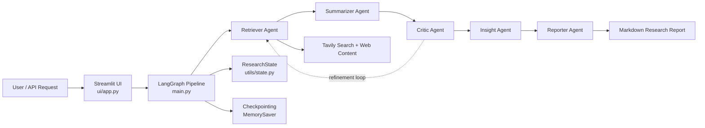
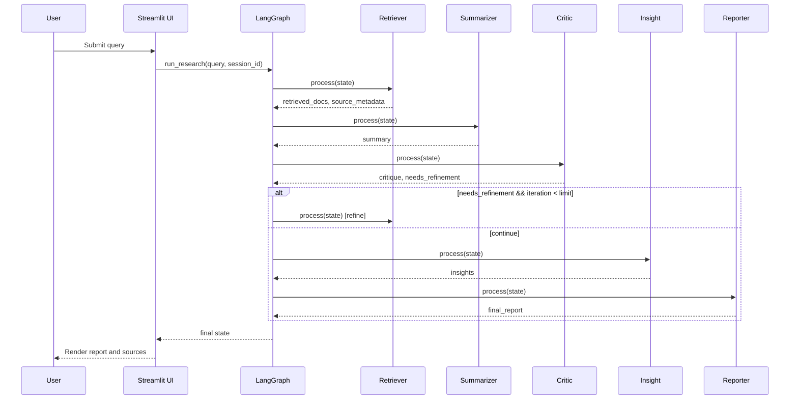

# Multi-Agent AI Deep Researcher

## About
Multi-Agent AI Deep Researcher is a production-style research system that converts a user question into a structured report using a coordinated set of specialized agents. The system combines web retrieval, iterative quality review, insight extraction, and report generation using LangGraph orchestration.

## Architecture


## Request Flow (Agent-to-Agent)


## AI Design Patterns Used
| Pattern | Where Used | Why It Is Used |
|---|---|---|
| Multi-Agent Pipeline | `agents/*.py`, `main.py` | Separates responsibilities across specialized agents. |
| Graph Orchestration | `main.py` (LangGraph `StateGraph`) | Defines deterministic execution order and transitions. |
| Shared State Contract | `utils/state.py` (`ResearchState`) | Standardizes data exchange across all agents. |
| Conditional Routing | `main.py` (`should_refine`) | Supports iterative refinement when quality is insufficient. |
| Retrieval-Augmented Generation (RAG) | `agents/retriever.py` + downstream LLM agents | Grounds generation on external web evidence. |
| Checkpointing | `main.py` (`MemorySaver`) | Preserves graph execution state across steps. |
| Base Agent Abstraction | `agents/base.py` | Enforces common interface, validation, and graceful failure behavior. |

## Core Concepts
| Concept | How It Appears In This Project |
|---|---|
| RAG | Web retrieval first, then LLM summarization/insight/reporting over retrieved context. |
| Multi-Agent System | Retriever, Summarizer, Critic, Insight, Reporter operate as modular agents. |
| Checkpointing | LangGraph checkpointer stores intermediate graph state. |
| Iterative Refinement | Critic can route flow back to Retriever until iteration limit. |
| Deterministic Control Flow | Supervisor and graph edges control routing without LLM-based planning. |

## Run the Project
### Prerequisites
- Python 3.10+
- Ollama installed and running
- Tavily API key

### Setup
```bash
cd Submissions-C4/Group_3/multi_agent_ai_deep_researcher
python -m venv .venv
# Windows
.\.venv\Scripts\Activate.ps1
# macOS/Linux
source .venv/bin/activate
pip install -r requirements.txt
```

### Configure
```bash
cp .env.example .env
# Set at minimum:
# TAVILY_API_KEY=your_key
```

### Start services
```bash
ollama serve
ollama pull mistral
```

### Launch
```bash
streamlit run ui/app.py
```

Open: `http://localhost:8501`