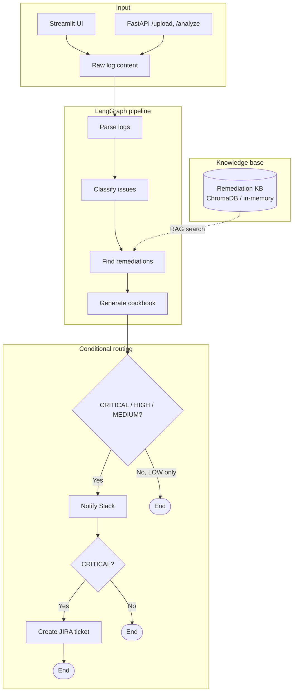
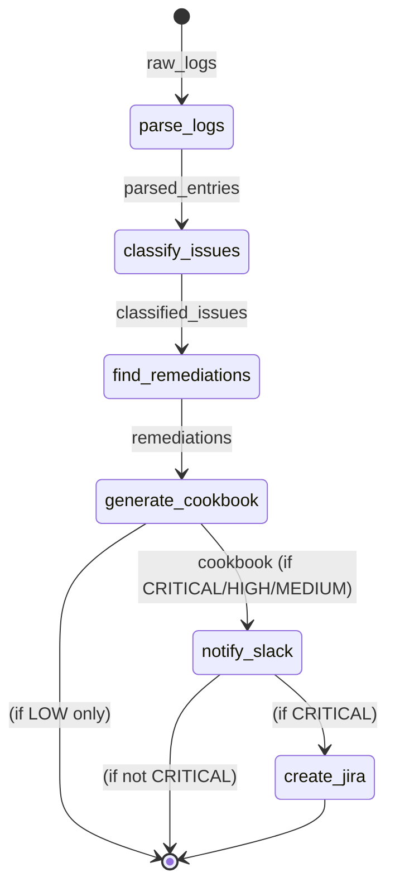

# DevOps Incident Analysis Suite — Workflow

View this file in **GitHub**, **VS Code** (Markdown preview), or [Mermaid Live Editor](https://mermaid.live) to render the diagrams.

---

## High-level flow



## Detailed agent workflow

```mermaid
flowchart LR
    subgraph Step1["1. Parse"]
        A[Log Parser]
        A --> |LogEntry[]| B[Structured entries]
    end

    subgraph Step2["2. Classify"]
        C[Log Classifier Agent]
        C --> |ClassifiedIssue[]| D[Category, severity, services]
    end

    subgraph Step3["3. Remediate"]
        E[Remediation Agent]
        KB[(Runbooks KB)]
        E --> |RemediationPlan[]| F[Steps, time estimate]
        KB --> E
    end

    subgraph Step4["4. Cookbook"]
        G[Cookbook Synthesizer]
        G --> |Markdown| H[Actionable runbook]
    end

    subgraph Step5["5. Notify"]
        I[Slack Notifier]
        J[JIRA Agent]
        I --> |#incidents-*| K[Slack]
        J --> |Ticket / comment| L[JIRA]
    end

    B --> C
    D --> E
    F --> G
    H --> I
    H --> J
```

## State flow (LangGraph)



## Components overview

| Component | Role |
|-----------|------|
| **Log Parser** | Detects format (JSON, syslog, Apache, etc.), extracts timestamp, severity, service, message, stack trace. |
| **Log Classifier Agent** | LLM-based: categories (database, network, application, infrastructure), severity (CRITICAL/HIGH/MEDIUM/LOW). |
| **Remediation Agent** | RAG over runbooks KB → maps each issue to steps and time estimate. |
| **Cookbook Synthesizer** | Produces one markdown incident response cookbook. |
| **Slack Notifier** | Block Kit message; channel by severity (#incidents-critical, #incidents-high, #incidents-low). |
| **JIRA Agent** | Creates or comments on ticket for CRITICAL; duplicate detection. |
